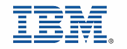

# IBM presents: Hyperledger Fabric Hands On Workshop - part 1


 



This document is available online here: 
## https://bit.ly/2J7DAN2

[Presentation slides for this workshop on slideshare](https://www.slideshare.net/GrantSteinfeld/ibm-presents-hyperledger-fabric-hands-on-workshop-part-1)


Learn to Build Blockchain Applications with Hyperledger Fabric


```
The Hyperledger Project is quickly becoming the front-runner in enterprise Blockchain solutions 
and has attracted talent and resources from industry leaders like IBM and Intel in an open
source collaborative effort to advance cross-industry blockchain technologies.
It is a global collaboration, hosted by The Linux Foundation, 
including leaders in finance, banking,
Internet of Things, supply chains, manufacturing, and Technology.
```
### What you will learn
1. Understand and setup the basics of Hyperledger Fabric network
1. How to code and run the FabCar tutorial
1. Be shown how to create and setup a smart contract example blockchain application using the IBM Cloud.

## Prerequisites
- [Node v8.x or greater and npm v5.x or greater](https://nodejs.org/en/download/)
- [Yeoman (yo) v2.x](http://yeoman.io/)
- [Docker version v17.06.2-ce or greater](https://www.docker.com/get-docker)
- [Docker Compose v1.14.0 or greater](https://docs.docker.com/compose/install/)
- [VSCode version 1.26 or greater](https://code.visualstudio.com)

```
Why Visual Studio Code.  It's easier to 
get things started.  There are perfectly adequate
shell scripts on the HyperFabric samples direcgtory that let you do this in case you are
a command line only programmer.
```
For windows user or to ensure the requirements are met also check out the [IBM Blockchain Platform Extension for VS Code](https://github.com/IBM-Blockchain/blockchain-vscode-extension/blob/master/README.md#requirements):

# Steps
## Development on your local environment
1. [Install IBM Blockchain VS Code Extension](#step-1-Install-IBM-Blockchain-VS-Code-Extension)


## Hands on Demos

Link to the Fabric Samples code:
```
git clone https://github.com/hyperledger/fabric-samples.git
cd fabric-samples/fabcar
```

## Follow along!

For later reference:

Lab documentation (Ubuntu!)
1) [Developing your first smart contract](https://github.com/ibm-blockchain-workshop/ibm-blockchain-workshop.github.io/blob/master/docs/Lab2-IBPVSCodeDevelopingyourFirstContract.pdf)


2) [FabCar demo](https://github.com/ibm-blockchain-workshop/ibm-blockchain-workshop.github.io/blob/master/docs/Lab3-IBPVSCodeExtensionUsinganExistingContract.pdf)


3) Demo Fabric on the IBM Cloud
[Hyperledger Fabric sample Using Event Handling with IBM Blockchain Platform V2.0](https://github.com/IBM/auction-events/)


### Useful links
#### Hyperledger Fabric

[Hyperledger Fabric 1.4.x docs](https://hyperledger-fabric.readthedocs.io/)

[Fab Car Demo code (alt to git clone)](
https://github.com/hyperledger/fabric-samples/tree/release-1.4/fabcar)

#### IBM Resources

[IBM Blockchain Platform](https://www.ibm.com/blockchain/platform)


Sign up for free IBM Cloud account 
https://ibm.biz/Bd2ugr

Visit [IBM Developer website](https://developer.ibm.com/)


## Help and about the presenter

```
Feel free to contact:

Grant Steinfeld
IBM Developer Advocate Blockchain / Java / NodeJS
North America East

   Twitter        @gsteinfeld
 
   Blog:          https://medium.com/@grantsteinfeld     
   GitHub:        https://github.com/grant-steinfeld
   LinkedIn:      https://linkedin.com/in/grant-steinfeld
   ...            https://GrantSteinfeld.com
   ```


